# MayaCraft

> Maya 2025 中文原生绑定与动画 Hero 展示版 · `workspaceControl + PySide6 + QPainter`

## 展示版速览

这一版主动收口长线研发，目标是形成可以直接录屏、面试讲解和现场操作的完整演示，而不是继续堆放
尚未闭环的按钮。核心路径均连接真实 Maya 场景，关键写操作遵循“预览 → 应用 → 读回验证 → Undo”。

| Character Workspace | 声明式 Rig Graph |
| --- | --- |
| 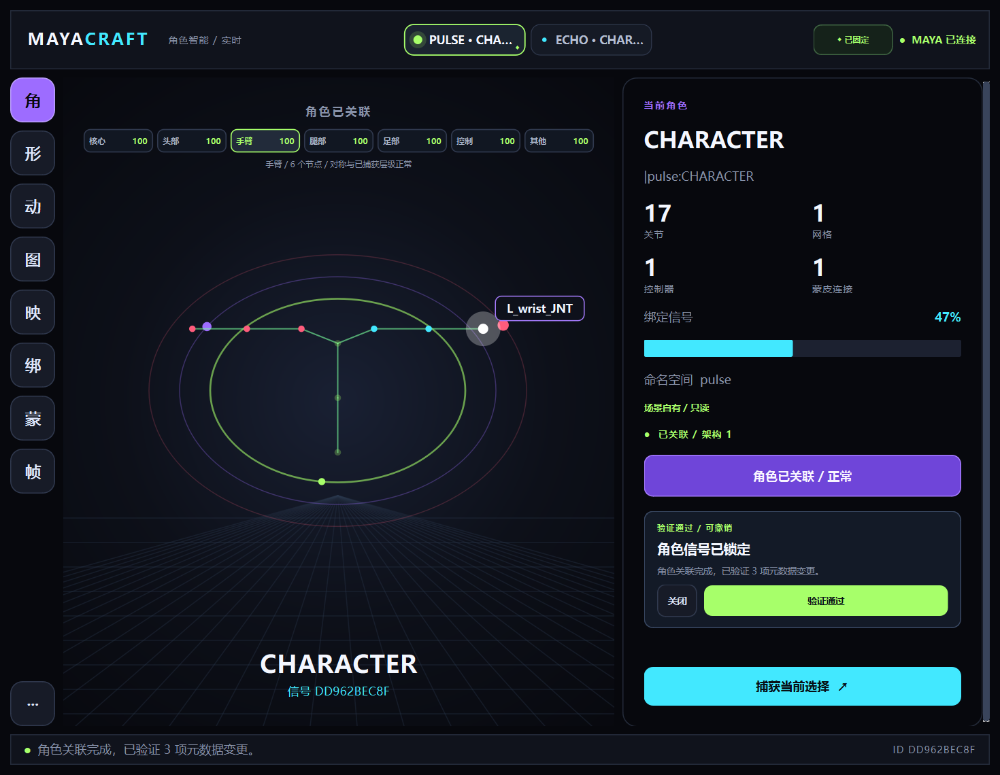 | 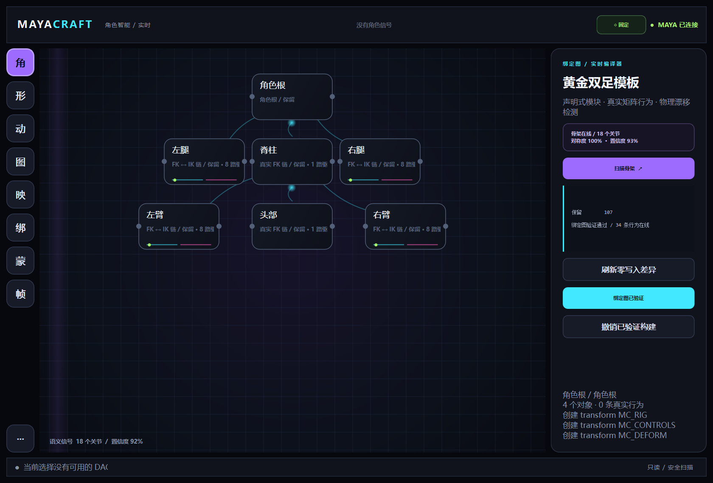 |
| Deformation MRI | Retarget + Contact IK |
| 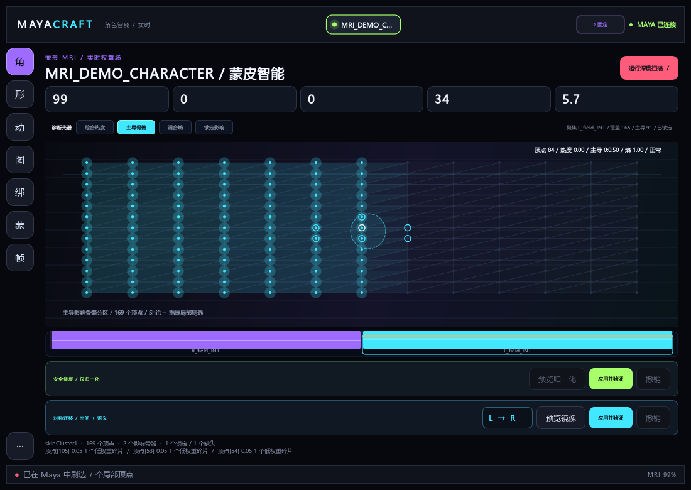 | 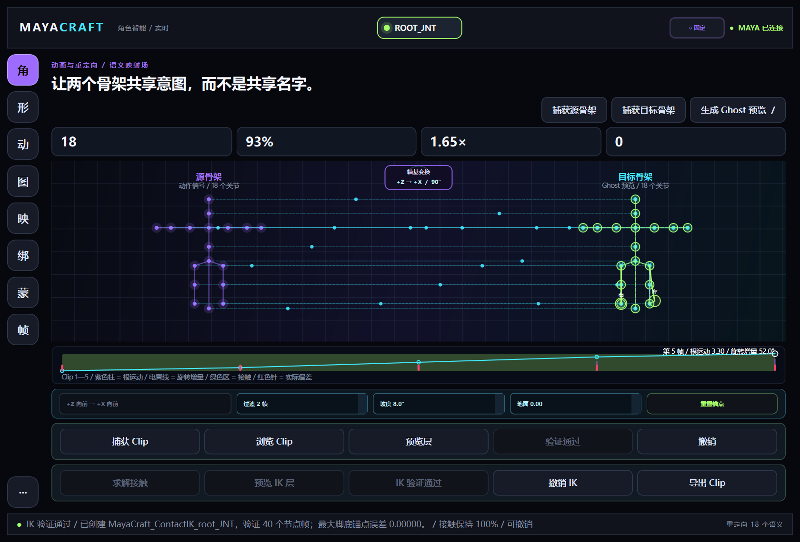 |

展示范围：动态角色工作区、Deformation MRI、Motion Magnetism、Retarget/Clip/Contact IK，以及可增量
构建的真实 FK/RP IK/Pole。MayaCraft 2.2 已完成时间感知的 FK/IK 无跳变匹配、带保护关键帧的
Space Switch 和 quaternion Twist 能量塑形；Bendy/Guide、Face PSD/RBF 与拓扑变化蒙皮迁移仍明确列入后续。

## Hero 功能：Quaternion Twist 能量塑形

MayaCraft 2.2 不再用“把某个 Euler 轴除以三”伪装 Twist。每条四肢的上、下骨段都会生成三枚实时
Twist 关节；DG 网络先计算起止关节相对四元数，把旋转向量投影到骨段的任意局部轴，分离纯 Twist 与
Swing，再通过 quaternion slerp 分配。弯肘、抬臂等 Swing 不会错误污染扭转结果。

| 零写入 Twist 曲线预览 | 应用、读回验证与实时关节 |
| --- | --- |
| 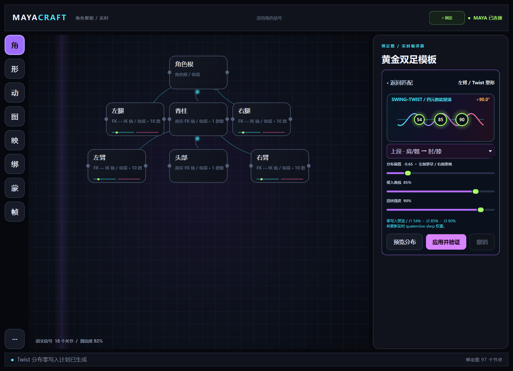 | 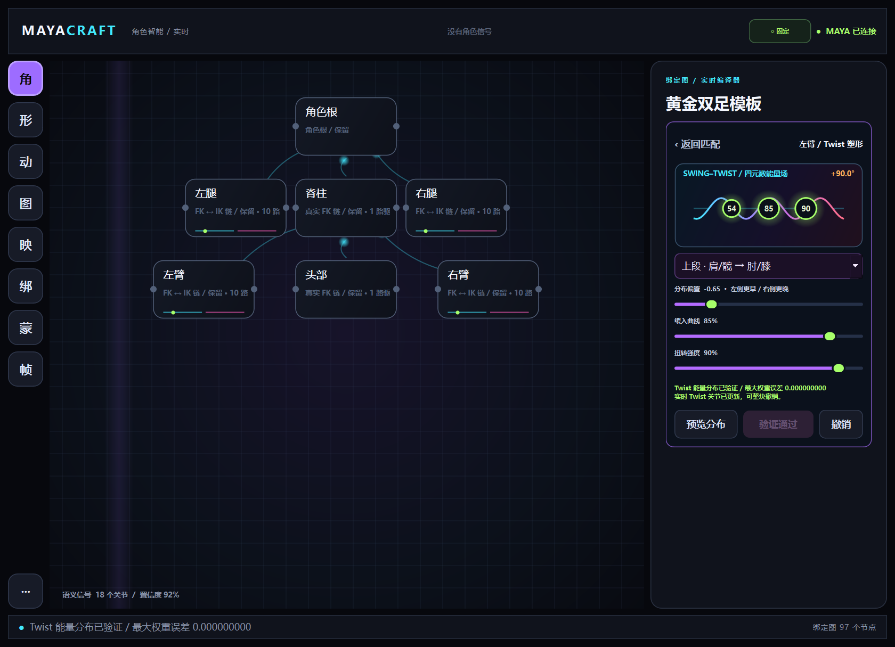 |
| 760×620 窄 Dock | 锁定权重的可信阻断 |
| 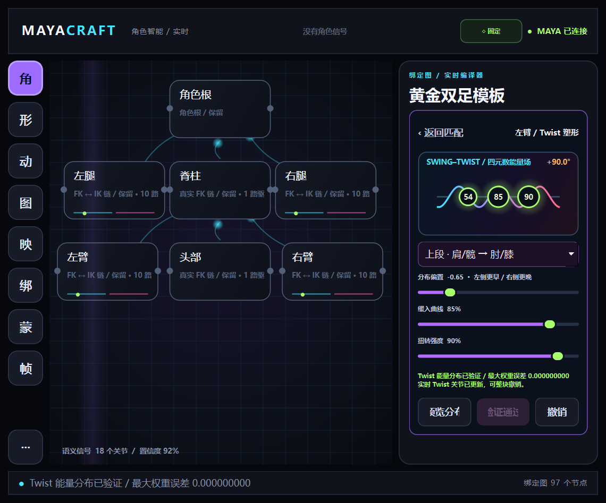 | 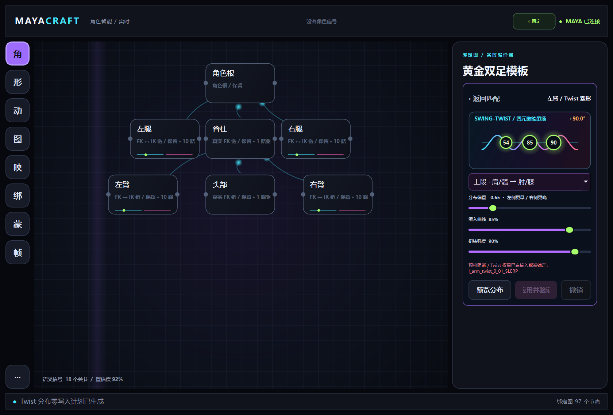 |

能量场直接读取当前骨段 Twist 角度并以动态螺旋显示三枚关节权重；“分布偏置、缓入曲线、扭转强度”
可自由塑造近端/远端受力。参数拖动只更新预览，显式点击后才进入漂移检查、单一 Undo chunk、读回验证，
失败自动恢复。整块撤销状态见 [`docs/images/twist_undo.png`](docs/images/twist_undo.png)。

| FK → IK 零写入预览 | 应用、读回验证与关键帧 |
| --- | --- |
| 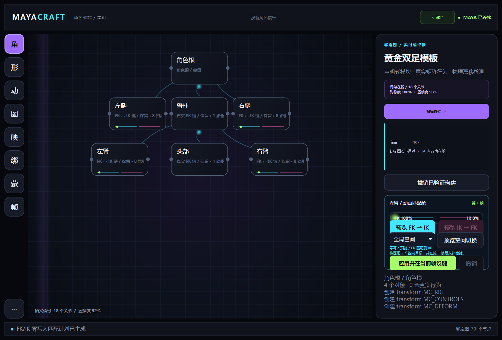 | 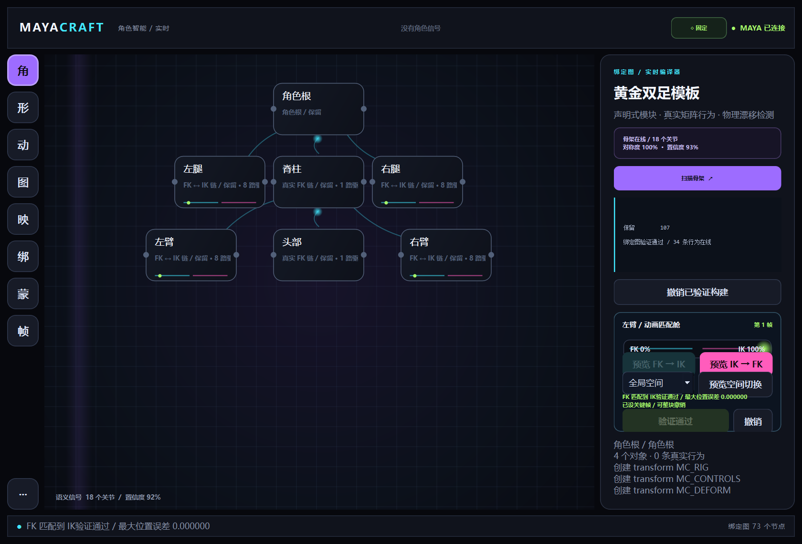 |
| 760×620 窄 Dock | 整块 Undo 验证 |
| 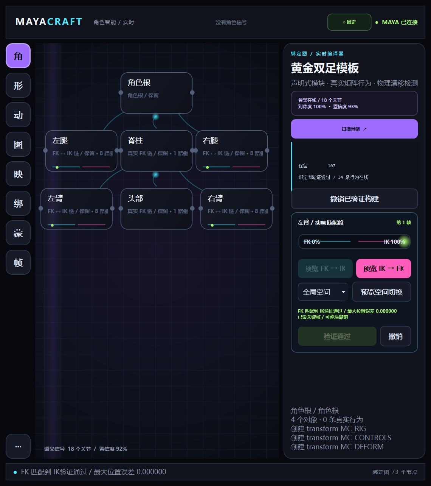 | 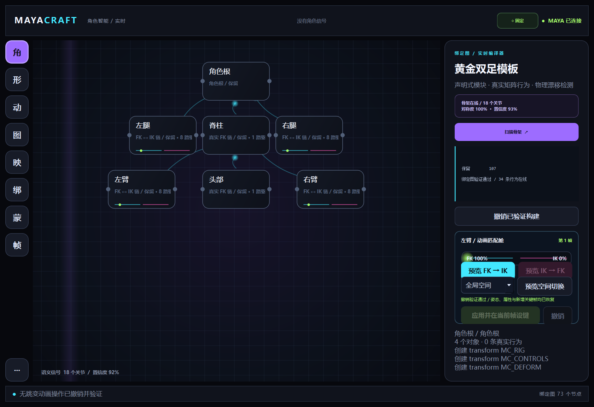 |

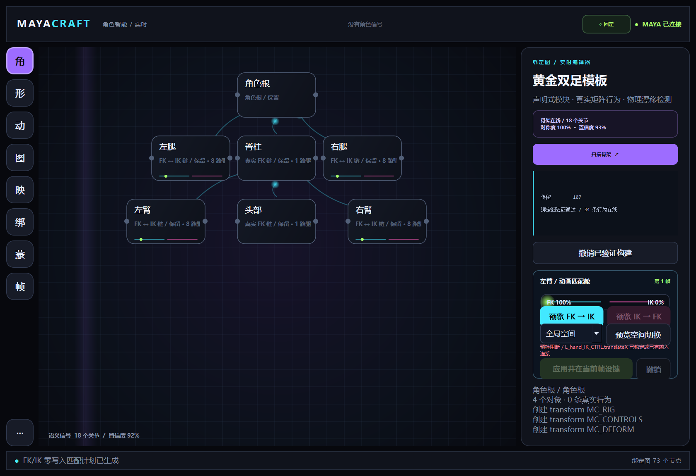

以上绑定匹配高清图由 Maya 2025 自带的同版本 `mayapy + PySide6` 直接渲染生产 Widget；不是另画的设计稿。
真实 Maya `workspaceControl` 的启动、重复打开、热重载和关闭清理另由隐藏 GUI 测试验证。

MayaCraft 面向国内企业展示与中文制作团队，主界面默认使用简体中文；Maya、FK/IK、RBF、Pose、
skinCluster 等必要行业术语按语境保留。原生 Qt 启动时会显式注册 CJK 字体，确保 Maya 2025 与
后台 mayapy 截图中的中文一致显示。

面向 Autodesk Maya 2025 的专业角色绑定与动画工具。MayaCraft 聚焦身体/面部绑定、蒙皮、动画制作、重定向和制作可视化，不再承载通用 TD 与节点诊断功能。当前展示版本只支持 Maya 2025、Python 3.11、PySide6 与 shiboken6，不维护多前端兼容矩阵。

产品方向、算法候选和阶段门槛见 `docs/DEVELOPMENT_PLAN.md`。当前组合展示已完成 Living Rig Canvas 1.0 与 Deformation MRI v0：真实 DAG 交互、多角色 Session、Rig Module Spectrum、skinCluster 热力诊断和可撤销归一化修复。

新的 Rig Graph 编译内核正在替换 legacy `RigBuilder`：版本化 Module/Socket/Node 声明、
control/deform/delivery 分层、结构 diff、增量 Build、全图读回验证和整块 Undo 已接入 Maya 2025。
节点声明之外还拥有独立的物理行为声明；首批真实 FK 控制曲线、形变关节和矩阵驱动网络已经落地，
断开连接会被识别为行为漂移，而不是继续相信旧 metadata；
旧构建页仍保留为行为参考，不把它的“捕获异常后继续”视为生产完成态。

## 当前 Character Workspace

MayaCraft 启动后以 `workspaceControl` 嵌入 Maya。首页已经改为角色驱动的
Kinetic Holographic Stage，而不是旧式功能标签集合：

- Maya 选择变化会触发防抖扫描，自动捕获角色上下文；
- 顶栏 Character Orbit 自动发现当前场景的已链接角色；未链接角色可固定到本次 session，
  点击轨道节点即可通过真实 Maya selection 在多个角色间切换；
- 中央动态舞台优先投影真实 Maya 关节位置与父子关系，按左右侧、控制器、
  当前选择和注册状态着色；无有效空间数据时才降级为抽象角色；
- 舞台节点具备实时 hover 光晕与浮动 HUD；点击节点会写回 Maya selection，随后由
  宿主 callback 重新捕获角色快照并点亮选中态，形成双向同步；
- Inspector 显示角色根、稳定 ID、命名空间、引用状态、关节、网格、控制器、
  SkinCluster 数量与结构评分；
- `Preview Character Link` 先生成零写入 ChangePlan，再以单一 Maya Undo chunk
  写入角色身份、稳定 ID 与 schema；写后重新读取验证，失败自动回滚；
- Change Capsule 显示每项 CREATE/UPDATE、阻断原因、验证结果和 Undo 可用状态；
- 扫描全程只读，支持空选择、深层级选择与公共资产组下的 namespaced 角色；
- 选择 callback 由窗口生命周期持有，重复启动和关闭会显式清理；
- 旧工具采用 lazy-load，从左侧 R/S/A 轨道进入，单一旧模块失败不会拖垮首页。

左侧 `D` 进入 Deformation MRI：

- Maya API 2.0 分批读取真实 `skinCluster` 权重，避免逐顶点命令循环；
- 计算 weight sum、活跃 influence、dominant influence、归一化 entropy、低权重碎片、
  locked / missing influence 和综合热度；
- 动态网格空间热力场从真实世界坐标做 PCA 主平面投影，用三角面、扫描波、深度和发光热点表达
  权重分布；hover 给出解释，点击可回选 Maya 顶点，`Shift + 拖拽` 可刷选局部组件；
- Normalize Repair 仅处理非零且明确未归一的向量，先预览 before/after，应用前检查漂移，
  写后 API 读回验证，并可在单一 Maya Undo chunk 中恢复原权重。
- “诊断光谱”可在综合热度、主导骨骼、混合熵和锁定影响四种网格场间即时切换；下方 influence
  光谱显示覆盖量、主导量和锁定状态，点击后聚焦该区域并回选真实 Maya 骨骼；matrix 空洞会显示
  具体槽位而不是只给一个模糊总分。

左侧 `M` 进入 Motion Magnetism 的首个真实切片：

- 按 Maya 时间上下文读取所选 joint/control 的 worldMatrix，不切换或扰动当前时间；
- 计算速度、加速度、jerk、累计弧长、四元数旋转跳变与带置信度的接触区间；
- 原生 QPainter Ghost Trajectory 使用时间渐变轨迹、接触磁场、速度 Ghost、jerk spike、
  rotation warning 和底部接触时间带表达真实运动；
- hover 读取帧和微分信号，点击轨迹样本可定位 Maya 当前帧。
- `SET BASELINE` 可锁定原始世界轨迹；再次捕获 candidate 后，同屏显示 RMS/MAX 空间误差、
  速度误差、接触保持率、虚线基准轨迹与逐帧误差 spoke，为空间切换和重定向比较提供依据。
- 接触样本可预览 Contact Anchor 时间影响场，并将补偿写入独立 additive Animation Layer；
  写前防漂移、写后重采样验证，失败自动回滚，Undo 后再次验证原运动恢复。

R4 的新 Pose/Clip 数据层已经开始替换旧 Animation 页：版本化 schema 同时保留本地/世界变换、
四元数、父语义和自定义标量通道；Clip 使用显式 DG 时间上下文采样，不移动 Maya 时间线。语义
Retarget Profile 可跨 namespace、比例和命名差异配对骨架，并生成零写入 Ghost Pose 及置信度；
新的“映”工作区已经把源/目标骨架、动态语义连接、映射置信度、比例差异和目标 Ghost 放到同一张
原生 QPainter 舞台；点击映射可同时定位 Maya 两侧关节。单帧 Ghost 始终零写入，Clip 工作流则在
明确预览后才允许进入独立 Animation Layer 事务。

重定向轴空间不再假定两套骨架共享世界前向。内置模板覆盖同向、`+Z → +X`、`+X → +Z`、前向
反转和 Z-up → Y-up；平移向量通过正交基矩阵变换，旋转增量通过四元数共轭变换，再进入目标
`jointOrient` 通道校准。切换模板会立即重算零写入 Ghost 并使旧计划失效；基础动画层存在期间模板
自动锁定，验证结果会把模板 ID 与中文名称写入 Clip metadata。

当前 Clip 路径已可捕获 Maya 播放范围，在时间带中查看根运动、最大旋转增量和双脚接触保持，并将
必要语义旋转与 root/pelvis 根运动写入独立 Override Animation Layer。写前检查目标漂移，写后按
local quaternion/translation 重采样验证，失败自动回滚，Undo 后证明目标基线恢复。该事务不会向每个
关节写平移来伪造 Ghost。旋转计划会校准目标 `jointOrient` 等静态轴偏移，并保留发生变化通道的
完整首尾采样键，避免 Override Layer 从后续动作向零差值首帧错误外推。

应用后会重新捕获目标实际 Clip，与 Ghost 做逐帧世界空间验证；时间带显示红色偏差针和接触保持率。
“接触 IK”可在不写场景的前提下，以 FABRIK 求解髋/膝/脚三点链：可达解显示薄荷绿，不可达解显示
橙色并给出精确末端缺口。双脚同时约束时会计算离原姿态最近的共同骨盆补偿，再把保长解转换成
目标 `jointOrient` 轴系下的髋、膝、脚旋转，写入独立 `MayaCraft_ContactIK_*` 覆盖动画层。写前检查
场景漂移，写后逐帧验证本地通道与脚底世界锚点，失败自动回滚；必须先撤销接触 IK 层，才能继续
撤销基础重定向层。

接触调校条可直接设置接触过渡帧、地面坡度与高度；根节点和双脚会按地面法线做四元数渐入对齐，
接触边界使用 Smoothstep 权重包络，避免第一帧硬吸附。舞台中的左右脚绿色锚环支持直接拖拽，拖动
期间只重新计算零写入预览，不改 Maya 场景；坡面参数、过渡帧与脚底锚点偏移会随验证结果写入
中文 Clip metadata，便于复现动画师的修正意图。

重定向工作区现在读写 `mayacraft.clip.package/v2`。资产包同时保存 Clip、参考姿态、可搜索名称、标签、
forward/up 坐标约定、metadata 与 SHA-256 指纹；写入采用原子替换并立即读回验证。v1 Package 会先按
旧规范验证原指纹再迁移，旧裸 `mayacraft.clip/v1` 会明确标记为“以首帧作为参考姿态”的迁移资产。
导入按便携节点键映射到当前源骨架，并阻断节点缺失、规模超限、轴空间或参考尺度不匹配。

“Clip 资产舱”可扫描最多 500 个 `.mayaclip`/JSON 资产，以名称、标签和路径搜索，并在加载前展示帧数、
帧率、时长、坐标轴、版本与资产状态。损坏文件保留为红色可诊断条目但不能加载；有效资产必须通过
节点拓扑、尺度、轴空间和节点帧规模预检，才会启用“载入并生成零写入 Ghost”。

当前旧工具包括：

| 标签页 | 已接入能力 |
| --- | --- |
| Rigging | 导入示例角色与骨架、骨骼标签、模块化 Build、控制器形状管理 |
| Face | 眼、眉、鼻、嘴唇、下巴、面颊与 bulge 等面部模块构建 |
| Skinning | 权重导入导出、复制、粘贴、镜像、平滑、Prune 与清理无用影响骨骼 |
| Animation | Pose 保存/应用/删除/镜像、曲线插值、时间和值偏移、烘焙与运动轨迹 |
| General | 对齐、批量命名、Transform 分组冻结、控制器替换和关节辅助操作 |

## 绑定系统

### 身体绑定

`core/rigging/` 实现了可组合的身体绑定模块：

- FK、IK 与 IK/FK 混合系统；
- 手臂、腿、脊柱等带标签模块；
- Aim、Stretchy、Segment Scale Compensation；
- Twist / Bendy 与 Inbetween Joint；
- 由 `priorities.json` 控制的构建顺序；
- 绑定结构、骨骼处理和控制器集合的分阶段 Build。

仓库同时包含多套原始骨架模板，可从 Rigging 页导入用于验证不同角色结构。`files/Rigged/` 中的示例资产来自各自来源，署名信息保存在对应目录的 `credit.txt`。

新的 `G` 工作区是 Maya 2025 原生 Rig Graph 编译器：从所选 joint 只读分析骨架语义和左右对称，
以动态模块图显示 typed sockets 与 CREATE/UPDATE/REPARENT/REBUILD/REMOVE 差异，再通过单一 Undo
事务增量构建并全图读回验证。黄金双足目前覆盖 7 个模块、97 个声明对象和 42 条物理行为；脊柱、
头部与四肢生成真实 NURBS 控制曲线、独立 FK/IK/result joint 链、RP IK + Pole、
`blendMatrix` FK/IK 混合与 `multMatrix → offsetParentMatrix` 驱动；手脚 IK 控制器提供基础全局/胸腔
Space Switch。新的动画匹配舱会在当前帧生成零写入计划：FK→IK 同时匹配末端、Pole、RP IK Roll
补偿和 `ikFk`；IK→FK 按父子顺序匹配三段 FK 控制器。应用时写入关键帧、重新读取三段结果关节并
计算世界位置/矩阵误差，失败自动回滚。Space Switch 会在上一帧写入旧空间保护键，在当前帧切换
空间并反算控制器局部通道，使世界姿态保持；Undo 会验证属性、姿态和新增关键帧全部恢复。
控制器会绑定到识别出的 spine/head/arm/hand/leg/foot 世界位置与朝向。输入骨架保持只读；连接断开、
源关节改名、结构漂移和引用节点变更均在应用前阻断或进入精确差异。旧 Rigging 页仍作为迁移期功能
入口，不再被视为可信构建内核。

### 面部绑定

`core/face/` 按部位拆分面部系统，包含 brow、eye、lip、jaw、nose、cheek 和 bulge 模块。系统配套：

- 定位器与分区选择逻辑；
- 曲线控制器形状数据；
- Surface / Polygon 权重 JSON；
- 单模块构建、全量构建和次级模块更新入口。

面部页不是单纯的按钮集合，实际构建逻辑位于 `core/logic/face/` 与 `core/face/systems/`，UI 只负责参数和流程组织。

## 动画与蒙皮工具

### Animation

- 保存当前控制器 Pose，并生成对应缩略图数据；
- 以百分比混合应用 Pose；
- 按左右命名规则镜像 Pose；
- Tween、Overshoot、线性插值；
- 关键帧时间偏移与数值偏移；
- 动画烘焙与 Motion Trail。

### Skinning

- JSON 权重导入与导出；
- 按位置或顶点序号组织导入流程；
- 复制、粘贴、镜像和平滑权重；
- 清理小权重与未使用 Influence。

新的 Deformation MRI 已加入可解释 Skin Mirror：先按名称语义和骨骼空间位置配对 influence，
再用空间哈希配对对称顶点，提供左到右/右到左零写入预览、置信度、拓扑不对称阻断、锁定骨骼保护、
写后读回验证与完整 Maya Undo。

MRI 可视层直接读取 MFnMesh 世界坐标和三角拓扑，通过 host-independent PCA 投影任意朝向网格；
大网格保留完整抽样面与全部异常热点，当前 100,000 顶点基准的投影构建低于 0.5 秒。

界面中的 Delta Mush 按钮目前为禁用状态，不列为已完成功能。

## 安装与启动

### 环境

- Autodesk Maya 2025；
- Maya 自带 Python 3.11、PySide6 与 shiboken6；
- Face 标签页额外依赖 PyMEL；未安装时仅该页显示依赖诊断，不影响其余标签页；

### 一键安装（推荐）

在 PowerShell 中先做零写入预览：

```powershell
.\install\install_maya2025.ps1 -Preview
```

确认路径后执行安装：

```powershell
.\install\install_maya2025.ps1
```

脚本只会在当前用户的 `Documents\maya\2025\modules` 写入一个 `MayaCraft.mod`，随后立即读回验证；
不会复制仓库、修改 Maya 安装目录或启动 Maya。移动仓库后重新运行脚本即可更新路径。

### 手动放置仓库

将仓库父目录加入 Maya 的 Python 搜索路径。假设目录为：

```text
D:\tools\MayaCraft\
```

则需要让 `D:\tools` 位于 `PYTHONPATH`，然后在 Maya Script Editor 的 Python 标签页运行：

```python
import MayaCraft.launch as launch
launch.run()
```

重复运行会先清理旧的 `MayaCraftWorkspaceControl`，再创建新的可停靠面板。普通艺术家会话不会自动重载全部模块；源码开发时可显式使用：

```python
launch.run(development=True)
```

每个旧模块独立加载。某个可选依赖或功能模块失败时，故障页会显示完整诊断，Character Workspace 和其余模块仍可使用。

## 演示素材与最短成功路径

仓库内置五套由 Maya 2025 确定性脚本自行合成的场景，不包含授权不明的第三方角色资产：

- 标准弯曲手臂 FK→IK 成功场景；
- IK 控制器通道锁定的预检阻断场景；
- 胸腔带动画的关键帧 Space Switch 场景；
- 左前臂 90° quaternion Twist 能量塑形场景；
- 缺少胸腔、头部和四肢语义的残缺骨架场景。

从 `demo/scenes/mayacraft_match_success.ma` 开始，在第 12 帧打开左侧“绑”工作区，点击
“预览 FK → IK”再点击“应用并在当前帧设键”，即可完成最短演示。素材说明见
[`demo/README.md`](demo/README.md)，完整操作见 [`docs/使用教程.md`](docs/使用教程.md)，录屏顺序见
[`docs/演示录制脚本.md`](docs/演示录制脚本.md)。

## 工程结构

```text
core/
├─ rigging/          FK、IK、IKFK、标签模块与构建流程
├─ face/             面部系统、控制器和权重数据
├─ logic/            各标签页的 Maya 操作逻辑
├─ animation/        动画曲线能力
└─ controller.py     控制器形状读写与替换
ui/                  绑定、面部、蒙皮、动画与通用制作标签页
compat/              Maya 2025 的 PySide6 / shiboken6 宿主表面
utils/               JSON、路径与开发期模块重载
files/ma/            原始骨架模板
files/shape/         控制器形状库
files/poses/         Pose 数据与预览
files/Rigged/        绑定示例资产及来源说明
launch.py            Maya workspaceControl 启动入口
docs/DEVELOPMENT_PLAN.md  产品边界、研究议程与分阶段开发计划
```

## 展示版边界

- 只支持 Maya 2025 / Python 3.11 / PySide6 6.5.3；
- Rig Graph 已覆盖真实 FK、RP IK、Pole、FK/IK 混合、带关键帧的无跳变 FK/IK Match 和
  全局/胸腔 Space 补偿；当前只对 MayaCraft 黄金双足生成的三段肢体开放；
- Bendy/Guide 高级编辑、Face PSD/RBF 重写、拓扑变化蒙皮迁移暂不进入本版；
- Face 仍是历史 PyMEL 实现，已与主界面隔离，但完整去除 PyMEL 需要后续专项重写；
- 自动绑定依赖骨骼命名、标签和场景结构，投入实际制作前应在副本场景验证；
- 原 TD 页已迁出到独立 MayaScope 仓库，MayaCraft 不再新增通用 TD 功能；
- 示例模型与贴图不是 MayaCraft 自有资产，二次使用前请阅读相应 `credit.txt`。

## 开发验证

离线与 mayapy 测试位于 `tests/`。真实 Maya 2025 GUI 的 workspaceControl、重复启动、
热重载、callback 清理和关闭验证可直接运行：

```powershell
& .\tests\run_maya2025_gui_validation.ps1
```

验证器只操作它启动的新 Maya 进程，成功后自动退出并在 `tests/artifacts/` 写入 JSON
报告和宿主截图。Hero Prototype 的逐项证据与未满足项见
`docs/HERO_PROTOTYPE_AUDIT.md`。
