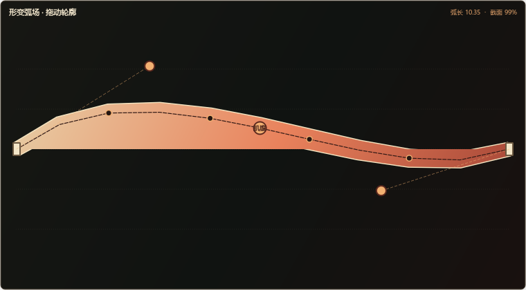

# Bendy「形变弧场」Hero 简报

状态：MayaCraft 2.3 展示版已完成并通过发布验收
目标宿主：Maya 2025

上图由 Maya 2025 自带 mayapy / PySide6 直接渲染生产 `BendyArcField`。真实应用、阻断和撤销状态见
`bendy_verified.png`、`bendy_blocked.png` 与 `bendy_undo.png`。

## 一句话演示

选择一条已经由 MayaCraft 构建的手臂或腿，拖动弧心塑造轮廓，调整两端切线与体积保持；MayaCraft 先用动态形变带展示结果，确认后才创建或更新真实 Bendy DG，并证明 Twist 仍沿新的弧线正确分布。

## 黄金路径

1. 从 Rig Graph 选择上臂、前臂、大腿或小腿骨段；
2. 进入“形变弧场”，读取起点、终点、局部轴、当前长度和 Twist 状态；
3. 拖动弧心，使用端点切线塑造 C/S 型轮廓；
4. 调整“弧度、端点松紧、体积保持”，画面连续更新但 Maya 场景零写入；
5. 点击“生成预览”，查看将创建或修改的控制器、曲线、关节和驱动行为；
6. 点击“应用并验证”，写入单一 Undo 事务；
7. 旋转末端验证 Twist 沿曲线工作，再整块撤销并验证原状态恢复。

## 可信失败

- 骨段长度接近零、端点不构成稳定局部平面；
- 不是 MayaCraft Rig Graph 生成的受支持骨段；
- 目标曲线、Bendy 关节或权重属性被锁定、引用或已有外部输入；
- 预览后骨段矩阵、当前 Rig Graph 指纹或 Twist 行为发生变化。

以上情况必须在写入前指出具体对象和原因，不生成半套网络。

## 算法与 DG 方向

- 宿主无关层以三次 Hermite / Bézier 弧表示骨段，使用弧长参数化而不是直接按曲线参数均分关节；
- Parallel Transport Frame 沿曲线传递局部朝向，避免 Frenet frame 在低曲率和拐点处翻转；
- 弧长变化驱动体积保持，默认采用可调幂律缩放，并设置艺术家可理解的安全范围；
- Maya 层使用原生 NURBS、fraction motionPath、curveInfo、distanceBetween、multiplyDivide、矩阵与 quaternion 节点；不依赖每帧 Python 回调；
- Twist 与 Bendy 分工：曲线切线决定主轴，现有 swing–twist 结果决定绕主轴旋转，组合顺序必须有可重复测试。

## 视觉路由

产品类型：Maya 内持续编辑型形变工作区  
核心用户：绑定师与动画技术美术，高频反复调形  
唯一主动作：直接拖动弧心，得到可信的零写入轮廓  
主要业务对象：骨段、曲线、切线、截面体积、Twist 能量  
宿主环境：深色 Maya Dock，目标宽度约 760–1120px  
预期感受：像在角色轮廓上画一笔有张力的弧线，而不是填写节点参数  
标志结构：一条占据主要面积的可操作形变带，端点像装订铰链，弧心像可抓取的肌肉腹  
反参考：节点监控大屏、AI 对话框、数据治理台、紫蓝霓虹卡片阵列

## 当前实现

宿主无关算法、QPainter 形变带、`bendy_curve` 行为、Maya DG 与预览/应用/验证/Undo 事务已经完成。
当前黄金双足包含 137 个声明对象、50 条物理行为；共享 Rig Graph、Quaternion Twist 和原生 UI 回归通过。
`mayacraft_bendy_sculpt.ma` 已提供可重复的第 12 帧 Twist + Bendy 组合场景；教程、录屏路径和五种
真实中文状态截图已落盘。75 项离线测试和 Bendy/旧 Rig Graph/Twist mayapy 组合回归通过；隐藏
Maya 2025 以 `2.3.0 / PySide6` 完成启动、重复启动清理、热重载和关闭清理，`.mod` 安装文件也已
写入并读回验证。测试进程退出后没有遗留 Maya 进程。
